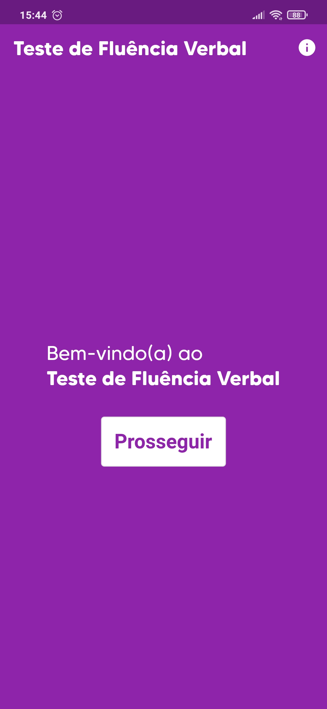
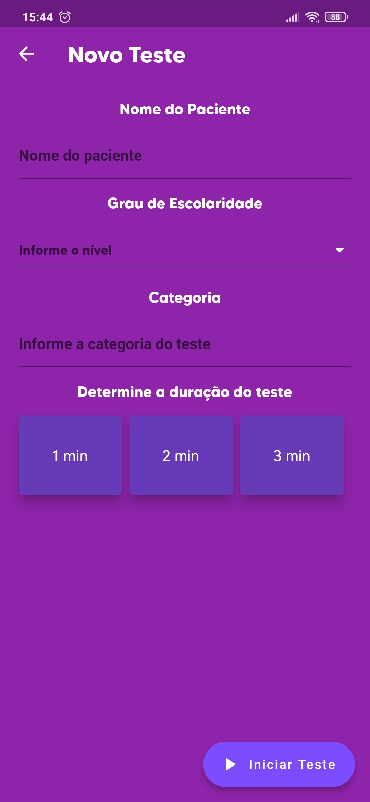
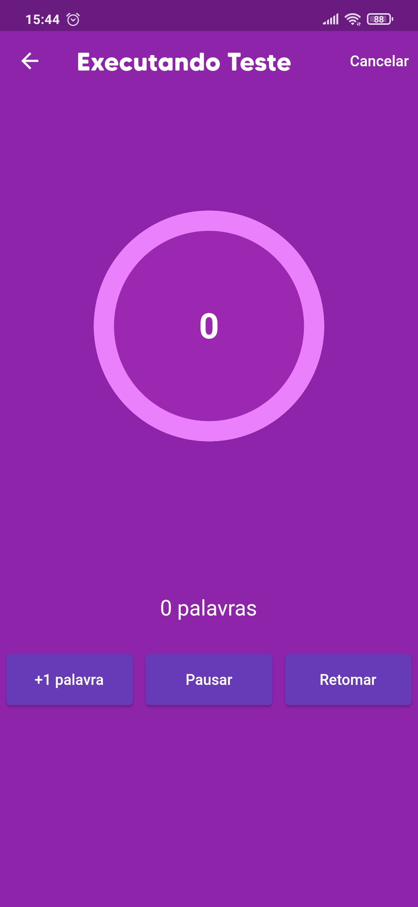

# Teste de Fluência Verbal

O aplicativo Teste de Fluência Verbal tem o propósito de auxiliar o usuário durante a execução do teste de fluência verbal, que consiste em solicitar à uma pessoa que responda em voz alta o maior número de palavras relacionadas à um determinado tópico. O app permite que o usuário registre cada teste com o nome da pessoa testada, o tópico e o tempo de duração. Durante a execução do teste, o áudio é gravado e o teste finaliza após o fim da contagem regressiva.

## Imagens da aplicação

| Tela inicial | Criar teste | Executando |
|------------|-------------|-------------|
| |  |  |
